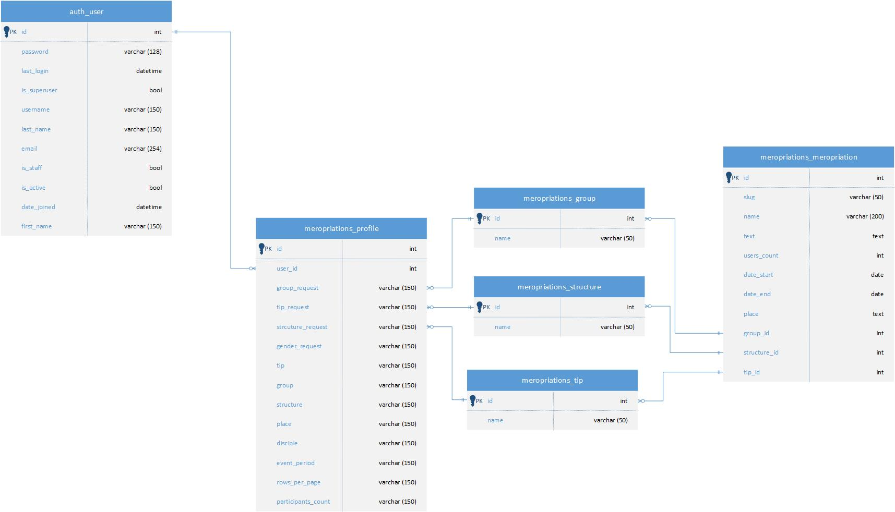

# Prosport calendar
## Интерактивная платформа для отображения календаря спортивных мероприятий, с возможностью фильтрации событий по ключевым параметрам
### Сайт-хостинг

<a href="https://mario12508.pythonanywhere.com/">https://mario12508.pythonanywhere.com/</a>

### Инструкция по запуску проекта локально
Все команды вводятся в терминале</br>
***Необходимо иметь установленные pip и python для терминала***

#### Клонируем проект

```commandline
https://github.com/hackathonsrus/pp_20299_pfo_ta_litseisti_kfu_102
```

#### Переходим в папку pp_20299_pfo_ta_litseisti_kfu_102

```commandline
cd prosport_calendar
```

#### Создаём и активируем виртуальное окружение
Рекомендуется использовать виртуальное окружение для изоляции зависимостей:<br>
Для Windows:
```commandline
python -m venv venv
venv\Scripts\activate
```

Для MacOS/Linux:
```commandline
python3 -m venv venv
source venv/bin/activate
```

#### Устанавливаем зависимости

```commandline
pip install -r requirements.txt
```

#### Переходим в папку с manage.py

```commandline
cd prosport_calendar
```

#### Настраиваем миграции

```commandline
python manage.py migrate
```

#### Запускаем сервер 

```commandline
python manage.py runserver
```

#### Переходим на сайт

<a href="http://127.0.0.1:8000/">http://127.0.0.1:8000/</a>

***Терминал не закрываем!***

### Возможные ошибки запуска
#### В случае возникновения ошибки с venv\Scripts\activate 

Решение проблемы:
- Открываем терминал PowerShell от админа.
- Вставляем и запускаем `Set-ExecutionPolicy RemoteSigned`
- На вопрос отвечаем `A`
- Продолжаем запускать проект по инструкции README.md с `Создаём и активируем виртуальное окружение`

#### Ошибка при загрузке requirements

Если у вас установлены несколько версий Python, используйте путь к нужной версии. Например, чтобы использовать Python 3.8, выполните команду:

**На Windows:**
```commandline
C:\path\to\python3.8\python.exe -m venv venv
```

Замените `C:\path\to\python3.8\python.exe` на путь к нужной версии Python, которую вы хотите использовать.

**На macOS/Linux:** <br>
Если у вас установлена нужная версия Python, вы можете использовать команду: <br>
```commandline
python3.8 -m venv venv
```

### ER - диаграмма

